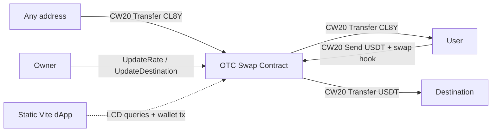

# CL8Y OTC Swap — Documentation

Monorepo for a trusted-owner OTC swap on Terra Classic.

## Architecture

## Folders

- **contracts/** — CosmWasm `cl8y-otc` contract
- **frontend/** — React + Vite static dApp
- **docs/** — This documentation

## Rate math

- `price` = USDT base units (18 decimals) per 1 whole CL8Y
- Default: `700000000000000000` = 0.70 USDT per CL8Y
- `cl8y_out = floor(usdt_in * 10^18 / price)`

See [contract.md](contract.md) and [frontend.md](frontend.md) for details.
