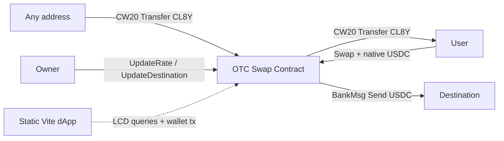
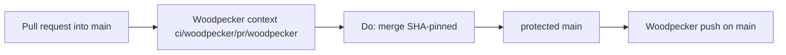

# Architecture overview

`code/cl8y-otc-terraclassic` is the trusted-owner OTC swap on Terra Classic:
users pay Noble USDC (IBC) and receive CL8Y CW20 at an owner-set price. This
tree is not the identity-smoke canary
([hello#15](https://git.cl8y.com/code/hello/issues/15) remains the **open**
CODEOWNERS canary). The landed product CODEOWNERS delete is
[dex#1309](https://git.cl8y.com/code/cl8y-dex-terraclassic/issues/1309).

Standing merge and CI rules live here. Catch-all `CODEOWNERS` removal is
[ADR 0001](adr/0001-remove-catchall-codeowners.md)
([#3](https://git.cl8y.com/code/cl8y-otc-terraclassic/issues/3)); do not
duplicate that narrative. Local invariant IDs are **H3-*** (this ticket).

This tree does not change Forgejo protection JSON, CAC autoland predicates,
Coolify app config, or on-chain CosmWasm deploy. Those remain
[cl8y-forgejo#48](https://git.cl8y.com/PlasticDigits/cl8y-forgejo/issues/48),
[cl8y-agent-control#429](https://git.cl8y.com/PlasticDigits/cl8y-agent-control/issues/429),
and [agent-control #297](https://git.cl8y.com/PlasticDigits/cl8y-agent-control/issues/297).

Do not add a local `docs/INVARIANTS.md`. The issue body points at cl8y-forgejo’s
copy (not in this tree). Local merge-gate rules are **H3-*** here and in
ADR 0001.

## Product tree

| Folder | Role |
| --- | --- |
| [`contracts/`](../contracts/) | CosmWasm `cl8y-otc` + deploy scripts |
| [`frontend/`](../frontend/) | Static Vite + React dApp |
| [`docs/`](.) | This overview, ADR 0001, contract/frontend/token specs |

Rate math (authoritative detail in [contract.md](contract.md) /
[tokens.md](tokens.md)):

- `price` = micro-USDC per 1 whole CL8Y (18 decimals)
- Default: `700000` = 0.70 USDC per CL8Y
- `cl8y_out = floor(usdc_in_micro * 10^18 / price)`

Message tables, wallets, admin UX, and mainnet instantiate (`columbus-5`
code id `11448`) stay in those specs and the root README. This overview
does not redesign them. Operator deploy / broadcast stays
[#297](https://git.cl8y.com/PlasticDigits/cl8y-agent-control/issues/297).

## Merge gate (H3)

Protected `main`. Operator
`GET /api/v1/repos/code/cl8y-otc-terraclassic/branch_protections` for the
`main` rule. This design pass received a 2xx GET (`updated_at`
2026-09-21T07:28:46Z, after
[cl8y-forgejo#48](https://git.cl8y.com/PlasticDigits/cl8y-forgejo/issues/48)
rollout on this repo). Flag *values* match the canary table in `code/hello`
architecture **H15**; IDs here are **H3-*** because this ticket is
[#3](https://git.cl8y.com/code/cl8y-otc-terraclassic/issues/3).

A green Woodpecker `tree` or gitleaks run is **not** proof of **H3-2**,
**H3-3**, **H3-5**, **H3-8**, or **H3-9**. #3 must not PATCH protection.
Re-read at merge; fail on drift from the table below.

### GET-required (close criterion 4 and test 3 — same list)

These are the only protection fields this ticket depends on.

| ID | Field | Required value (observed 2026-09-21T07:28:46Z) |
| --- | --- | --- |
| **H3-2** | `enable_push` | `false` (no direct `main`, no force-push) |
| **H3-3** | `enable_status_check` + `status_check_contexts` | `true` and `ci/woodpecker/pr/woodpecker` |
| **H3-5** | `block_on_rejected_reviews` | `true` |
| **H3-8** | `block_on_official_review_requests` | `false` (leftover official requests on [#3](https://git.cl8y.com/code/cl8y-otc-terraclassic/pulls/3) / [#2](https://git.cl8y.com/code/cl8y-otc-terraclassic/pulls/2) must not block) |
| **H3-9** | `required_approvals` | `0` |

Do not include **H3-4** (`Do: merge`) in GET matching: it is the merge API,
not a protection field.

### GET-observed (do not touch; not in close matching)

| Field | Observed value | Rule |
| --- | --- | --- |
| `block_on_outdated_branch` | `true` | Do not PATCH from #3. Product head must rebase onto current `main` before merge. |
| `dismiss_stale_approvals` | `true` | Do not PATCH from #3. |
| `apply_to_admins` | `false` | Do not PATCH from #3. |

Close criterion 4 / test 3 must **not** be read as “GET equals this whole
architecture table.” Observed rows are inventory so an implementer does not
“fix” them.

### Non-GET rules

| ID | Rule |
| --- | --- |
| **H3-1** | No `CODEOWNERS` at the four Forgejo search paths (repo root, `docs/CODEOWNERS`, `.gitea/CODEOWNERS`, `.forgejo/CODEOWNERS`) requesting a user or team. File line is `@code/maintainers`; PR JSON team `name` is `maintainers` (org `code`). Either form is the same leftover plant. Do not leave an empty or comments-only file; Forgejo still parses it. |
| **H3-4** | Merge is SHA-pinned `Do: merge` (`head_commit_id`). Never document or use `force_merge`. |
| **H3-6** | No Coolify/Woodpecker secrets on `pull_request`. This tree does not grow a deploy step from #3. CosmWasm instantiate / `contracts/scripts/deploy.sh` stays #297. |
| **H3-7** | This tree does not expand CAC merge/deploy/spend/custody policy. |

Official CODEOWNERS review is **not** a merge gate. Forgejo loads the first
existing file among `CODEOWNERS`, `docs/CODEOWNERS`, `.gitea/CODEOWNERS`, and
`.forgejo/CODEOWNERS` (Go-regexp, not GitHub globs). A catch-all `.*` still
plants team `maintainers` on every non-WIP PR. After ADR 0001, `test -f`
fails on all four (**H3-1**). None of those paths may contain a reviewer
rule for any pattern.

Root README must point at this gate and ADR 0001. Architecture-only is not a
substitute for that pointer. See ADR 0001 decision 3 / slice S2.

## Pipeline

[`.woodpecker.yml`](../.woodpecker.yml) is the stub landed by
[#1](https://git.cl8y.com/code/cl8y-otc-terraclassic/pulls/1)
(`NO_CI_MISSING_WOODPECKER`): gitleaks (`zricethezav/gitleaks:v8.18.4` +
[`.gitleaks.toml`](../.gitleaks.toml)) and Alpine `tree` (non-empty
worktree) on `push`, `manual`, and `pull_request`. The required merge
context is `ci/woodpecker/pr/woodpecker` (**H3-3**). Filename is `.yml`
(not `.yaml`); do not rename, and do not add `.woodpecker/<other>.yaml`
(that would post `ci/woodpecker/pr/<other>` and fail **H3-3**).

#3 does not upgrade, digest-pin, add secrets, or replace this file. Cargo
`cargo test` and frontend Vitest/Playwright stay local/product checks; they
do not substitute for the Woodpecker context.

This repo has no Coolify app and no Woodpecker deploy step. Do not attach
secrets to `pull_request` events. On-chain OTC deploy is operator-run under
[#297](https://git.cl8y.com/PlasticDigits/cl8y-agent-control/issues/297),
not merge policy.

`docs/` is already tracked (this is not a Foundry tree with a directory
ignore of `docs/`). Do not add a `docs/` ignore.
